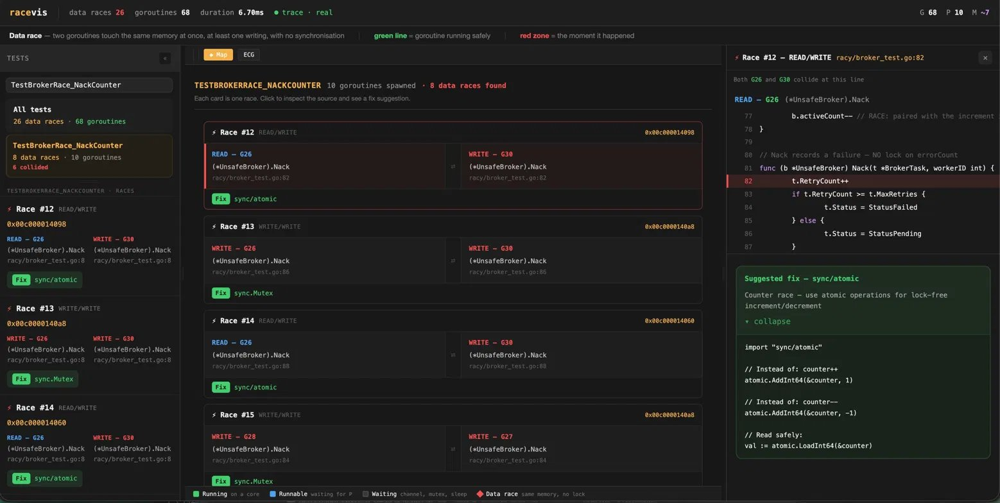
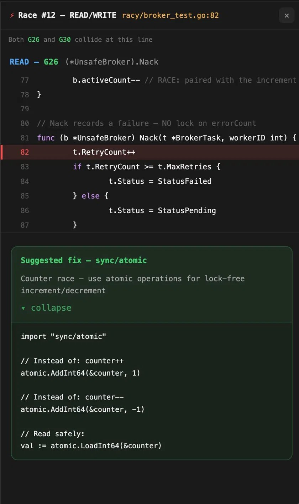

# racevis

**An interactive race condition visualizer for Go.**

The Go race detector tells you *that* a race happened and *which lines* are involved — but the output is a wall of text. When multiple goroutines are racing across several functions, reconstructing the timeline mentally is slow and error-prone.

racevis runs your tests with the race detector, captures the scheduler trace, and renders an animated timeline where you can see exactly which goroutines collided, on which memory address, and at what point in time. It also suggests how to fix each race.


---

## Views

### ECG Timeline
Each goroutine is a horizontal line. A pulse moves left to right as time advances. When two goroutines touch the same memory address simultaneously, the line turns **red** at that exact moment. Hover a collision zone for a plain-English explanation. Click it to open the source panel.

### Map View
Browse all detected races as structured cards — each showing the two goroutines involved, the memory address they contested, and a suggested fix.



### Source Panel
Opens when you click a collision zone or race card. Shows the racing lines of code with the exact race line highlighted in red, plus copy-paste ready fix suggestions.



---

## Install

```bash
go install github.com/bramakrishna16/racevis@latest
```

Or build from source:
```bash
git clone https://github.com/bramakrishna16/racevis
cd racevis
go build -o racevis .
mv racevis /usr/local/bin/    # optional: add to PATH
```

**Requirements:** Go 1.22 or later. Your project must have tests that exercise concurrent code.

---

## Usage

### Analyze the bundled demo
```bash
go run .
# Open http://localhost:7777
```

### Analyze your own project
```bash
racevis -target ./path/to/package
```

### Analyze one specific test (faster)
```bash
racevis -target ./path/to/package -run TestMyRace
```

### Run race detector multiple times (catches intermittent races)
```bash
racevis -target ./path/to/package -count 3
```

### Watch mode — auto-refresh on file changes
```bash
racevis -target ./path/to/package -watch
# Browser updates automatically when you save a .go file
```

### Export a self-contained HTML report
```bash
racevis -target ./path/to/package -report report.html
open report.html    # works offline, no server needed
```

### Export timeline JSON (for CI or custom tooling)
```bash
racevis -target ./path/to/package -json timeline.json
racevis -target ./path/to/package -no-server    # prints to stdout
```

### Resolve memory addresses to variable names (experimental)
```bash
racevis -target ./path/to/package -dwarf
# Shows "variable counter" instead of "0x00c000112198" in tooltips
# Note: gives container name only for maps, slices, and interfaces
```

### All flags
```
-target    Go package directory to analyze (default: bundled demo)
-run       Run only tests matching this regex, e.g. -run TestMyRace
-count     Number of race detector passes (default 1, higher catches more races)
-watch     Re-analyze on every .go file change, auto-refresh browser
-report    Write a self-contained HTML report to this file
-json      Write timeline JSON to this file
-no-server Print timeline JSON to stdout
-port      Web UI port (default 7777, tries next available if taken)
-dwarf     Resolve memory addresses to variable names (experimental)
```

---

## Reading the UI

### Left panel
Each test function that spawned goroutines gets its own section. The dropdown at the top lets you filter by a single test. Race-free tests appear under "✓ Safe" in the dropdown; racy tests appear under "⚡ Racy".

Each race card shows:
- Which goroutines were involved and what operation each performed
- The memory address that was contested
- A suggested fix with copy-paste ready code (click the ▸ triangle to expand)

### ECG Timeline
- **Green line** — goroutine running or runnable on a CPU core
- **Flat baseline** — goroutine blocked (waiting on channel, mutex, sleep, syscall)
- **Red vertical markers** — collision zone boundaries
- **⚡ #N label** — which race event this collision belongs to

### Map View
Each card shows one race: the two goroutines, their access type (READ/WRITE), the function and file:line for each side, and the fix suggestion. Click any card to open the source panel.

### Source Panel
Opens when you click a collision zone or race card. Shows the racing lines of code — the goroutine that wrote on the left, the one that read on the right. The exact racing line is highlighted in red. Expand the suggested fix block for copy-paste ready Go code.

---

## How it works

racevis runs two separate passes against the target package:

**Pass 1 — Race detection**
```bash
go test -race -count=1 ./...
```
The race detector instruments every memory access. When two goroutines touch the same address without synchronization, it emits a `WARNING: DATA RACE` block. racevis parses this into structured `RaceEvent` objects.

**Pass 2 — Scheduler trace**
```bash
go test -count=1 -trace=file.out .
go tool trace -d=parsed file.out
```
The runtime trace captures every goroutine state transition with nanosecond timestamps. racevis parses this into `SchedulerEvent` objects and correlates them with the race events by goroutine ID.

**Report mode** (`-report`)
The self-contained HTML report bakes the timeline JSON directly into a `<script>` tag before the main application script. The page loads inline data instead of fetching from a server, so it works completely offline.

**Watch mode** (`-watch`)
A polling loop checks `.go` file modification times every 500ms. On change, racevis re-runs both passes and pushes a reload event to the browser via Server-Sent Events. The browser re-renders without a manual refresh.

---

## Writing tests for race detection

racevis can only find races in code paths exercised by your tests. For concurrent code without tests yet, a minimal test that drives concurrent execution is enough:

```go
func TestMyConcurrentCode(t *testing.T) {
    svc := NewMyService()
    var wg sync.WaitGroup
    for i := 0; i < 10; i++ {
        wg.Add(1)
        go func() {
            defer wg.Done()
            svc.DoSomething()
        }()
    }
    wg.Wait()
}
```

The test doesn't need assertions — its purpose is to drive concurrent execution so the race detector can observe it. Run `racevis -count 3` to run it multiple times and catch races that only manifest under specific scheduling.

---

## Common race patterns and fixes

| Pattern | Detected by | Fix |
|---|---|---|
| `counter++` / `counter--` | `++` or `--` on racing line | `sync/atomic` |
| Concurrent map access | `runtime.mapassign` in stack | `sync.RWMutex` |
| Lazy singleton init | `== nil` check on racing line | `sync.Once` |
| Loop variable capture | Closure with loop variable | Capture by value: `i := i` |
| Struct field access | `.field =` on racing line | `sync.Mutex` embedded in struct |
| Slice append | `append(` on racing line | Mutex or channel-based fan-in |

---

## Architecture

```
racevis/
├── main.go              Entry point — CLI flags, orchestration, analysis pipeline
├── dwarf.go             Optional DWARF variable name resolution (-dwarf flag)
├── runner/              Executes go test and go tool trace
├── parser/
│   ├── race.go          State machine parser for race detector output
│   └── trace.go         Parser for scheduler trace events
├── correlator/          Joins race events + trace into a Timeline struct
├── source/              Reads source files, extracts snippets around race sites
├── server/              HTTP server: /api/timeline, /api/events (SSE), static UI
├── ui/index.html        Single-file vanilla JS frontend (embedded into binary)
├── testdata/racy/       Demo package with intentional race conditions
│   ├── main.go          Four classic race patterns (counter, map, init, closure)
│   ├── main_test.go     Test entry points for the classic patterns
│   └── broker_test.go   Realistic task-queue races and a safe comparison
├── docs/
│   ├── DESIGN.md        Full architecture document
│   ├── assets/          Screenshots and demo GIF for README
│   └── adr/             15 Architecture Decision Records
└── scripts/
    └── install-hooks.sh Installs the pre-commit lint hook
```

---

## Contributing

See [CONTRIBUTING.md](CONTRIBUTING.md) for setup, testing, and coding conventions.

Quick start:
```bash
git clone https://github.com/bramakrishna16/racevis
cd racevis
go test ./...         # run all unit tests
bash scripts/install-hooks.sh  # install pre-commit lint hook
go run .              # run against the bundled demo
```

---

## Known limitations

- **Collision zone placement is approximate.** The race detector fires after the fact — racevis places the red zone at the nearest overlapping running windows of the two goroutines, which is an approximation. See ADR-006.
- **`-trace` covers the root package only.** `go test -trace` does not support `./...`. Goroutines from sub-packages appear only if invoked from the root package's tests. See ADR-008.
- **DWARF resolution is best-effort.** For maps, slices, and interfaces, only the container variable name is shown (not the key or element being accessed). Stack-allocated variables may not be resolvable if they were inlined or optimized away.
- **Two passes, non-deterministic.** Race detection is probabilistic — different runs may catch different races. Use `-count N` to run multiple passes and increase coverage.

---

## License

MIT
